# NX Plaza

An Online StreetPass System for the Nintendo Switch.

The 3DS traded a few hundred bytes with every console you physically walked
past. The Switch has no radio homebrew can drive that way, so **NX Plaza**
keeps everything else about the idea and moves the trade to the internet: your
console quietly swaps a small **pass** with other consoles that share your
network or your corner of the internet, and you come back later to a stack of
them.

## What a pass is

About 450 bytes of JSON. A chosen name, a greeting of at most 60 characters, a
card theme, **your Mii**, optionally a title you have played, up to four small
things you are "carrying", and a coarse place label you typed yourself.

The title is picked, not typed: the console keeps a play history, so *Your pass →
Title on your pass* steps through the last five games with **A** and defaults to
the most recent.

It is deliberately "last played" rather than "playing now" --
there is no such thing while this app is in the foreground, since homebrew
launched from hbmenu has either taken the game slot or is sitting over the album.

*Settings → Show what I am playing* strips it from the outgoing pass entirely,
and a console that has played nothing shows the row as empty rather than
inventing one.

It never contains your account name, your friend code, your IP, or a position.

## Your Mii

Make a face in *Your pass → Your Mii*: face shape, skin, hair and its colour,
eyes and theirs, eyebrows, nose, mouth, glasses, facial hair, headwear, build,
and the placement of it all. **X** shuffles, **A** keeps it, **B** backs out, and
**L/R** jump ten at a time through the long lists.

Every part carries the scale, rotation and position the Mii format gives it -
eye width, height and tilt, eyebrow spacing, thickness and tilt, and the size and
placement of the nose, mouth, moustache, glasses and mole. Two faces built from
the same parts are told apart by exactly those.

The parts are the real Mii catalogue - 12 face shapes, 132 hairstyles, 60 eyes,
36 mouths, 24 eyebrows, 18 noses, 20 glasses, 12 wrinkles, 12 makeup, 6
moustaches, 6 beards and 8 hats.

A moustache and a beard are separate, as they are in the Mii format, so
you can wear both.

A pass that has never been through the maker still shows a face: one derived
from the portrait seed the pass already carries. Nobody is a blank silhouette.

## Games

Seven things to play with the people you have crossed. All of them can be
played for nothing; where there is a bet it is optional, and the odds are
honest and against you, so the games are a way to spend coins rather than a way
to make them.

- **The Mii race** - three people you have met against your own Mii, over four
  lanes. Back your Mii for a coin, or call first and second for more.
- **The dice duel** - one roll each against somebody you crossed, highest takes
  it, a draw hands your bet back.
- **The lantern wheel** - twelve lanterns and a needle. Every lantern pays
  something and two of them pay a puzzle piece.
- **The bandit** - a slot machine in a casino room, two sets of reels with
  **X** to switch, and a board on the wall listing every line it pays.
- **The Mii tower** - drop the people you have met on top of each other, one
  floor at a time, and keep the tower standing.
- **The quest** - a tower with no top, climbed by a party drawn from your
  collection: what everybody is worth comes off their Mii and how often you
  have crossed them. The fight runs itself, and what it is for is the gear the
  shadows drop, common up to godlike. A floor pays one coin the first time you
  reach it in a week and the tower resets every Monday, so the ground you have
  already covered is worth climbing again. **Y** to equip the party, **ZR**
  opens the bag, and the shop sells whetstones that roll a piece of gear again
  without changing its rank. **ZL** locks a piece, in the bag or on the gear
  screen: a padlock appears beside its name and nothing throws it away until
  you unlock it.
- **Plaza dash** - your own Mii runs through the plaza, **A** jumps, and it
  gets quicker until you hit something. Nothing staked and nothing won: it
  keeps a best distance and that is all.

## Identity

On the very first launch the app generates:

| Field | Size | Purpose |
| --- | --- | --- |
| `id` | 128 bits, hex | public; travels with every pass so repeat crossings can be recognised |
| `token` | 256 bits, hex | secret; bearer token that proves the id is yours |

Both come from the console's CSPRNG (`csrngGetRandomBytes`, falling back to
`randomGet`) and are stored at `sdmc:/switch/nx-plaza/identity.json`.

Nothing about them is derived from the hardware: no serial, no MAC, no account id.

Copy that file to move your plaza identity to another console; delete it (or use
*Settings → Start over*) and you are somebody new, with everything you already
handed out permanently unlinkable from you.

*Settings → Data → Copy everything to a backup folder* puts it, your pass and
your collection into `backup/<date>/`. They are plain files, so putting one back
is a matter of copying it over the original - there is no restore button and
nothing that only this app can read. It is the same card, though, so copy the
folder to a computer if you want to survive losing the card.

The first-run screen shows a short human form of the id (e.g. `K4M-92X7`) plus
a 9×9 fingerprint pattern, so two people standing together can confirm they are
looking at the same console without reading 32 hex characters aloud.

## How "walking past someone" works without a radio

Two signals, both of which the console can produce honestly:

1. **Place token** - `SHA-256("nx-plaza/place/v1|" + SSID)`, truncated to 64
   bits, computed *on the console*. Two Switches on the same café, station or
   campus network land in the same bucket. The SSID itself never leaves the
   console.
2. **Network area** - the server buckets the source address by `/24` (IPv6
   `/48`). This catches consoles on Ethernet, and groups people behind the same
   ISP egress.

*Settings → How far a crossing reaches* picks how much of that you accept:
`Same network` (closest to real StreetPass), `Nearby`, or `Anywhere` - a
world plaza, so an empty town is not a dead app.

**`Anywhere` is the default.** The narrower settings are closer to what
StreetPass actually was.

Exchanges are mutual and rate limited: at most 12 crossings a day by default,
one crossing per pair per six hours.

## Building

Requires devkitPro with the Switch toolchain:

```sh
dkp-pacman -S switch-dev deko3d switch-curl switch-freetype switch-jansson switch-mbedtls
make            # -> nx-plaza.nro
make DEBUG=1    # links -ldeko3dd, the deko3d validation layer
```

Copy `nx-plaza.nro` to `sdmc:/switch/nx-plaza/nx-plaza.nro` and launch it from
hbmenu.

The puzzle artwork is not inside the NRO.

Copy `data/assets/pictures.bin` to
`sdmc:/switch/nx-plaza/data/assets/pictures.bin` as well, or fetch it on the
console with *Settings → Data → Download puzzle art*. Without it the puzzles
draw numbered tiles and nothing else changes.

Each picture is 1280×720, cut five by three, stored as BC1 - 450 KB apiece,
decoded by the GPU.

Fonts come from the console's own shared font block.
What ships inside the NRO is the two compiled shaders and the baked Mii part artwork.

## Controls

Every screen carries the same control strip along the bottom, so the buttons
are always spelled out for the view you are on.

| Input | Action |
| --- | --- |
| L / R | previous / next tab |
| D-pad or stick | move the cursor |
| A | open, edit, toggle - in the square, look at whoever the cursor is on; in Settings, the only way into a section |
| B | back |
| X | plaza: look for passes now · collection: change sort (recent, name, starred) · trophies: filter (all, earned, still to earn) · the square: shuffle the crowd · your pass: new portrait · encounter: block and forget · Mii maker: shuffle |
| Y | plaza: mark everything read · collection: star this card · puzzles: fill this one next · encounter and radar: save that face · Mii maker: save / load faces |
| B | back - in Settings, out of a section's rows to the section list |
| + | quit |

Handheld adds touch. It is additive: every button above still does what it did.

| Touch | Action |
| --- | --- |
| drag | scroll the plaza, the collection or the settings list |
| flick | scroll with momentum; touch again to stop it |
| tap a card, row or setting | select it and open, edit, or toggle it |
| tap one option of a segmented control | choose exactly that option |
| tap an icon in the rail | switch tab |
| tap outside a sheet or dialog | close it |
| tap a notification | dismiss it |
| tap the bin on a saved face | delete it, after confirming |
| tap your own portrait on the pass screen | reroll it |

The cursor and the finger stay in step: moving the cursor scrolls the list to
keep it visible, and after a drag the cursor moves to whatever is nearest the
middle of what you are now looking at, so pressing **A** always acts on
something on screen.

The panel is inert when docked, and the code needs no special case for that: the
console simply reports no touches.

## Files on the SD card

```
sdmc:/switch/nx-plaza/
  identity.json    public id + secret token (back this up)
  profile.json     your pass and every setting
  crossings.idx    the passes you have collected, one 128-byte record each
  crossings.dat    their text: greetings, what they carry, where you crossed
  crossings.ext    extras kept per crossing: starred, the piece they brought
  data/assets/     the puzzle artwork, delivered with the app by the updater
  pending.json     blocks the plaza has not been told about yet; gone once it has
  wallet.dat       coins earned and spent, checked against your own token
  quest.dat        how deep the quest has been, this week's progress and the
                   gear it turned up, checked the same way
  plaza.log        only when Settings turns it on; off by default
  plaza.log.1      the previous 256 KB, kept when the log rotates
  cacert.pem       needed for https connections to the plaza server
  backup/          copies made by Settings -> Data, one folder per day
  export/          faces you saved, one JSON file each
```

`export/` is the only folder you are meant to open.

**Y** in the Mii maker opens
it: the top row saves the face you are editing under a name you type, and every
row below loads one back, or is deleted with the red bin on its right - press
**Right** to cross to it, or just tap it - after a confirmation. **Y** on a
card - an encounter, or a console on the radar - saves that person's face
there too, so a face you liked is yours to keep and to build on.

Files are named by what you type, so they are yours to copy off the card, hand around and drop
back in; anything already in the folder shows up in the list.

A face saved by a different version is listed but will not load, for the same reason one does not
come off the wire: the indices mean different things and it would come back as somebody else.

## Light and dark

The app opens in **light** and can be switched in *Settings → Appearance →
Theme*: `Light`, `Dark`, or `Console` (follow the Switch's own light/dark
setting, re-read whenever the app regains focus). The choice is saved in
`profile.json`.

## Languages

*Settings → Languages* picks one; the choice takes effect straight away and is
saved in `profile.json`. All twelve are complete.

| | | |
| --- | --- | --- |
| English | Français | Deutsch |
| Español | Italiano | Nederlands |
| Português | Русский | 日本語 |
| 한국어 | 简体中文 | 繁體中文 |

What stays in English is data rather than words: handles, greetings, place
labels and the things a pass carries, since those travel to other consoles and
are compared between them.

## Trophies

All 80 of them, as the app lists them. Nearly every one is worked out from
your collection, your puzzles and your wallet at the moment the screen draws,
so it cannot disagree with what actually happened; the three about the plaza
dash read the best distance that game keeps. None of them pays a coin, and
none unlocks anything.

### Bronze (25)

| | |
| --- | --- |
| **Somebody's out there** | Cross one other console. |
| **Properly introduced** | Give your pass a name, a greeting and something to carry. |
| **Fully laden** | Carry four things on your pass at once. |
| **A corner of something** | Take your first puzzle piece off a crossing. |
| **Worth keeping** | Star a card. |
| **Ten faces** | Cross ten different consoles. |
| **A week of it** | Open the app on seven different days. |
| **Two down** | Finish two puzzles. |
| **First purchase** | Buy something in the shop. |
| **Beginner's luck** | Win a bet in the games tab. |
| **First blood** | Win a duel at the dice. |
| **Six all** | Roll a six against a six. |
| **Lined up** | Line up three of a kind at the bandit. |
| **The wheel's own** | Win a puzzle piece on the lantern wheel. |
| **Ten storeys** | Stack ten floors in the Mii tower. |
| **Dead centre** | Land a floor within six pixels of the one below. |
| **Off the mark** | Run a hundred metres in the plaza dash. |
| **Your own face** | Make a face of your own in the Mii maker. |
| **Redecorated** | Give your card a look of your own. |
| **Out in the world** | Have your pass reach somebody. |
| **Matching outfits** | Cross somebody whose card wears the same look as yours. |
| **Same taste** | Cross somebody carrying something you carry too. |
| **The strong silent type** | Cross a pass with nothing written on it. |
| **A shadow on the stair** | Clear a floor of the quest. |
| **Something to wear** | Find your first piece of gear in the quest. |

### Silver (32)

| | |
| --- | --- |
| **A busy afternoon** | Cross ten consoles in one day. |
| **Fifty faces** | Cross fifty different consoles. |
| **A hundred faces** | Cross a hundred different consoles. |
| **A hundred hellos** | Cross people a hundred times, the same ones included. |
| **A regular** | Cross the same console ten times. |
| **Around town** | Cross people in five different places. |
| **Ten places** | Cross people in ten different places. |
| **The late train** | Cross somebody between midnight and four. |
| **Every day of the week** | Cross somebody on each of the seven weekdays. |
| **A fortnight** | Open the app on fourteen different days. |
| **An old friend** | Keep a card for six months. |
| **A picture at last** | Finish a puzzle. |
| **Halfway through** | Hold half of every piece there is. |
| **A picture by committee** | Take pieces from ten different people. |
| **A shortlist** | Star twenty-five cards. |
| **Nothing left unread** | Open every card you hold, with fifty of them. |
| **Reciprocated** | Send something back to twenty-five people. |
| **Namesake** | Cross somebody who chose the same name as you. |
| **Somebody with a life** | Cross a pass carrying a thousand hours in one title. |
| **The shop's best customer** | Spend five hundred coins. |
| **Saving up** | Have five hundred coins at once. |
| **On a run** | Win five duels at the dice in a row. |
| **A good day at the tables** | Win fifty coins betting in the games tab. |
| **Sevens** | Line up three sevens at the bandit. |
| **Twice lucky** | Win two puzzle pieces on the lantern wheel. |
| **Twenty up** | Stack twenty floors in the Mii tower. |
| **Steady hands** | Land five floors in a row dead centre. |
| **Talked it down** | Lean a tower to the edge of going over, and bring it back. |
| **A good run** | Run five hundred metres in the plaza dash. |
| **Ten floors up** | Reach the tenth floor of the quest. |
| **Well turned out** | Have somebody wearing a weapon, armour, a ring and an accessory at once. |
| **A full stair** | Take five up the tower at once. |

### Gold (22)

| | |
| --- | --- |
| **Five hundred faces** | Cross five hundred different consoles. |
| **A thousand faces** | Cross a thousand different consoles. |
| **A thousand hellos** | Cross people a thousand times, the same ones included. |
| **Practically neighbours** | Cross the same console fifty times. |
| **Far travelled** | Cross people in twenty-five different places. |
| **Fifty places** | Cross people in fifty different places. |
| **A month of it** | Open the app on thirty different days. |
| **A hundred days** | Open the app on a hundred different days. |
| **A year of it** | Open the app on three hundred and sixty-five different days. |
| **Known you for a year** | Keep a card for a year. |
| **Every picture** | Finish every puzzle. |
| **By hand alone** | Finish a puzzle without buying a single piece. |
| **The full set** | Line up three of a kind of every symbol the bandit has. |
| **Five from the wheel** | Win five puzzle pieces on the lantern wheel. |
| **Thirty storeys** | Stack thirty floors in the Mii tower. |
| **A kilometre of plaza** | Run a thousand metres in the plaza dash. |
| **Seven in a row** | Win seven duels at the dice in a row. |
| **The bookmaker's problem** | Win two hundred coins betting in the games tab. |
| **Fifty contributors** | Take pieces from fifty different people. |
| **Twenty floors up** | Reach the twentieth floor of the quest. |
| **Legendary** | Hold a legendary piece of gear. |
| **Godlike** | Hold a godlike piece of gear. |

### Platinum (1)

| | |
| --- | --- |
| **The whole plaza** | Earn everything else. |

## Disclaimer

This is a homebrew app. It is not affiliated with Nintendo, and it is not
officially supported. Use at your own risk. The author is not responsible for
any damage or loss of data that may occur from using this app.

## Screenshots

**Around the plaza.**

| | |
| --- | --- |
|  |  |
| *What is waiting, newest first, each one badged until you read it.* | *A pass opened - their greeting, what they carry, how often you have met.* |
|  |  |
| *The radar - who has the app awake right now, in the reach you chose.* | *The collection - everyone you have met, by recent, name or starred.* |
|  |  |
| *The Square - twenty of them standing about, yourself among them.* |  |

**Puzzles, the shop and the record.**

| | |
| --- | --- |
| 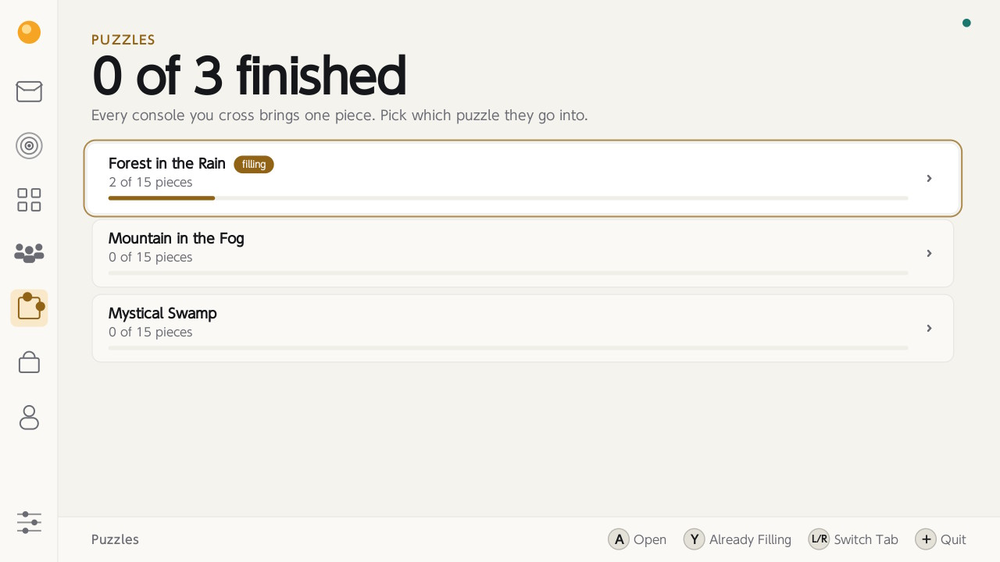 | 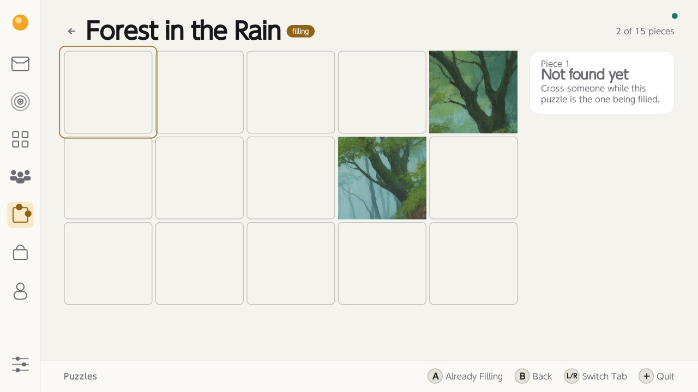 |
| *Six pictures, fifteen pieces each, one piece a crossing.* | *A board - every tile says who brought it and when.* |
| 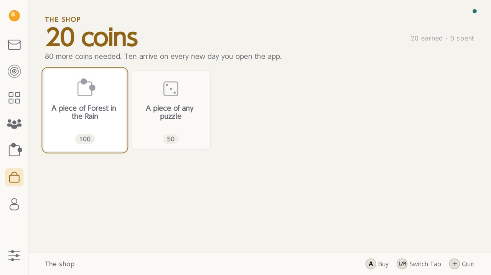 | 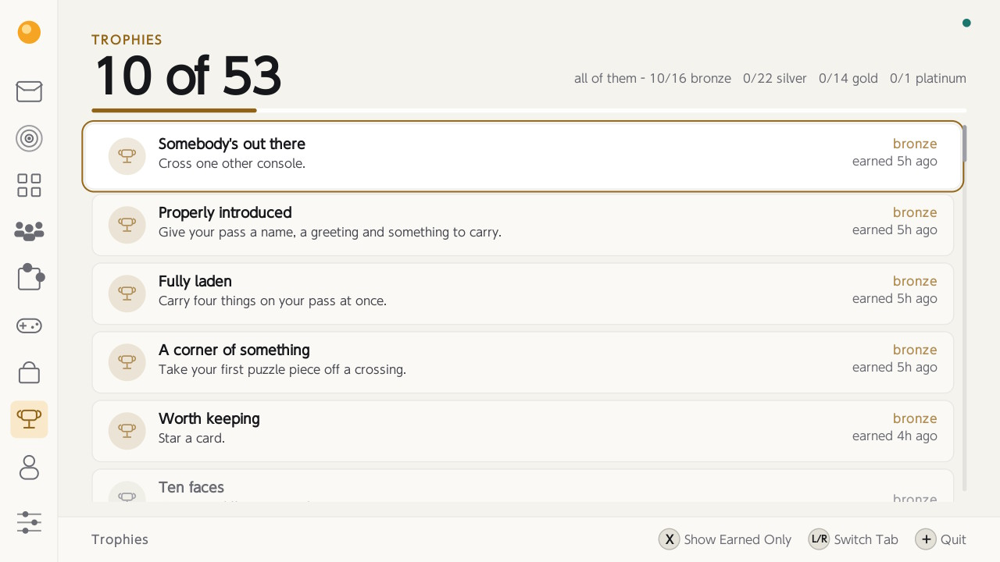 |
| *The shop - ten coins a day, and two things to spend them on.* | *The trophies - eighty of them, all worked out from the collection.* |

**The games.**

| | |
| --- | --- |
| 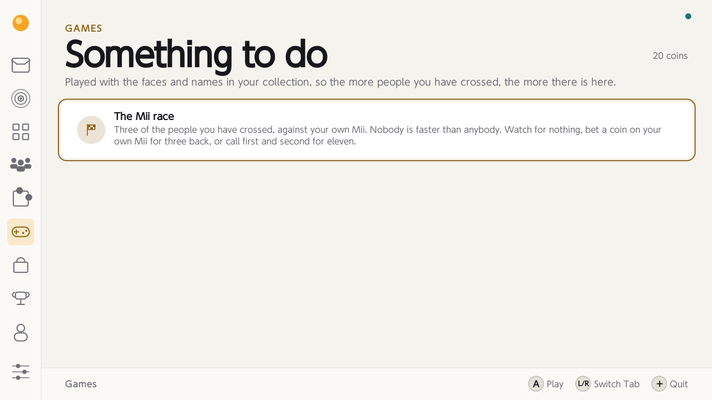 | 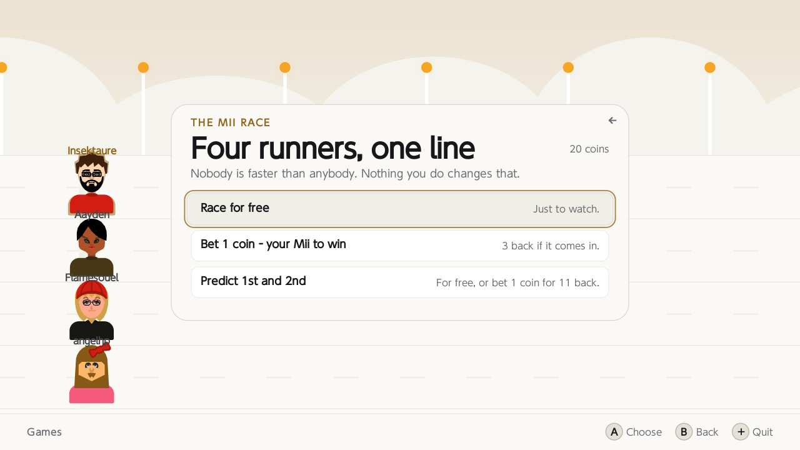 |
| *The shelf - what there is to play, and the coins you have.* | *Race for nothing, a coin on your own Mii, or call first and second.* |
| 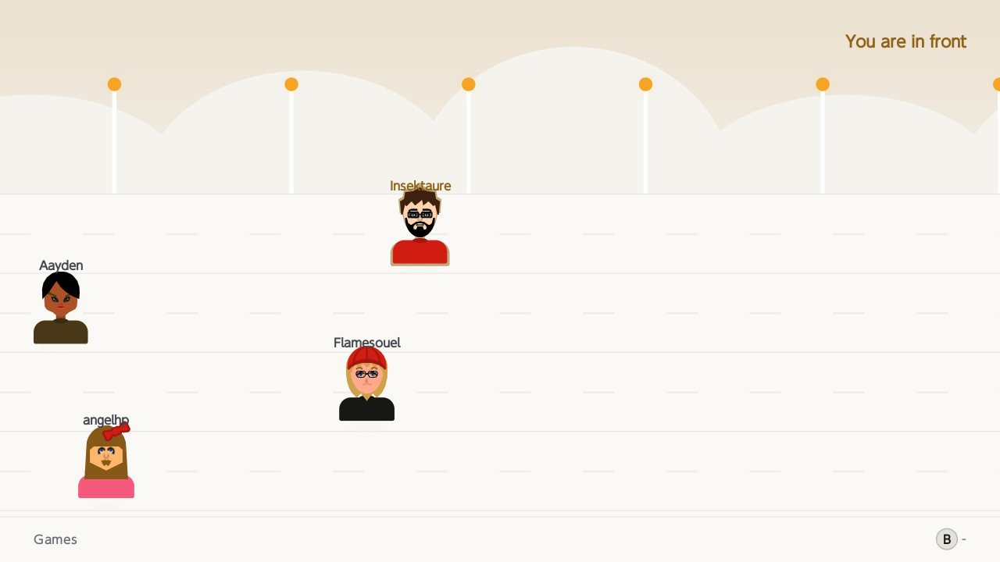 | 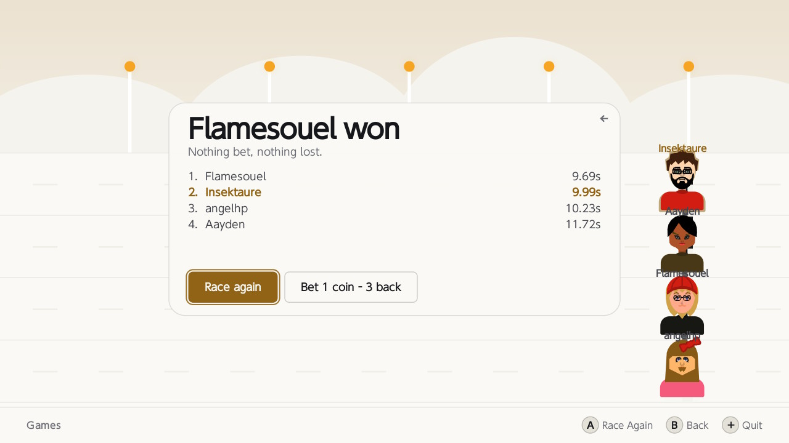 |
| *The run - a parallax track, and who is in front.* | *The order at the line, to the hundredth of a second.* |
| 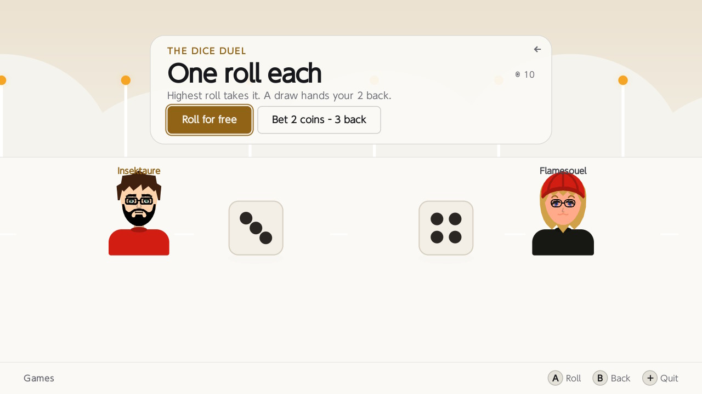 | 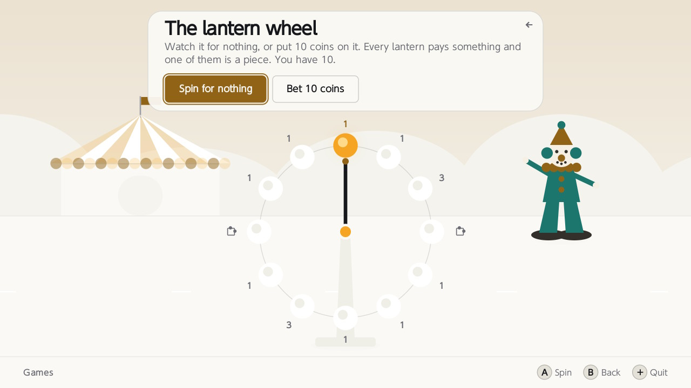 |
| *The dice duel - roll for nothing, or two coins for three back.* | *The wheel - what every lantern pays, written up before you spin.* |
| 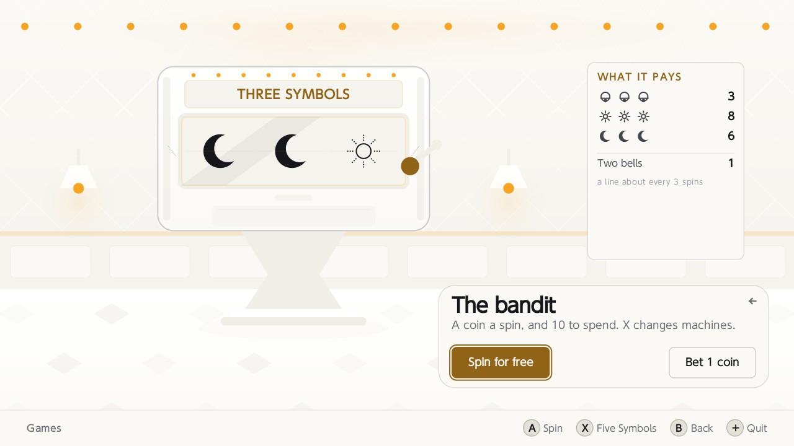 | 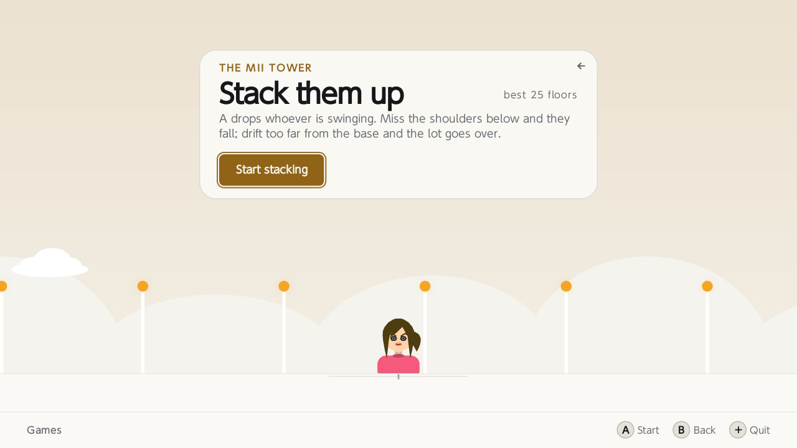 |
| *The bandit - three symbols or five, and every line it pays.* | *The tower - whoever is swinging drops where you let go.* |
| 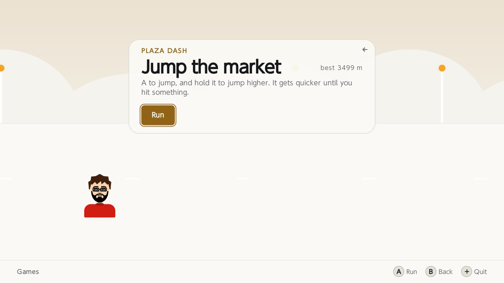 | 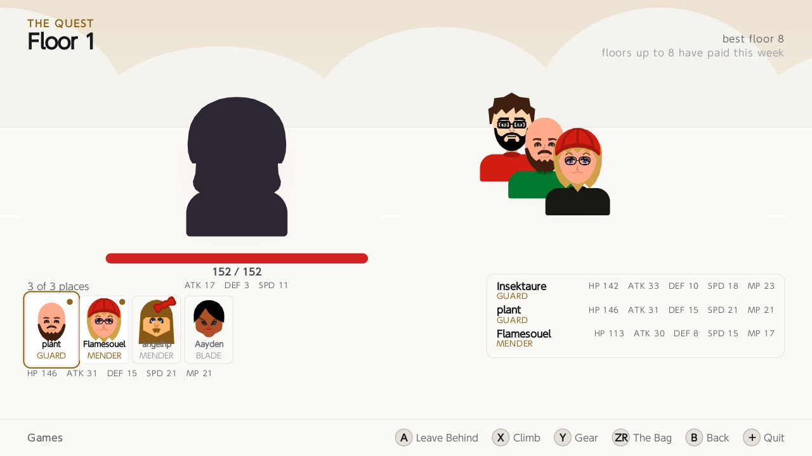 |
| *Plaza dash - the market to jump, and a best distance.* | *The quest - who goes up, on the ground they will fight on.* |
| 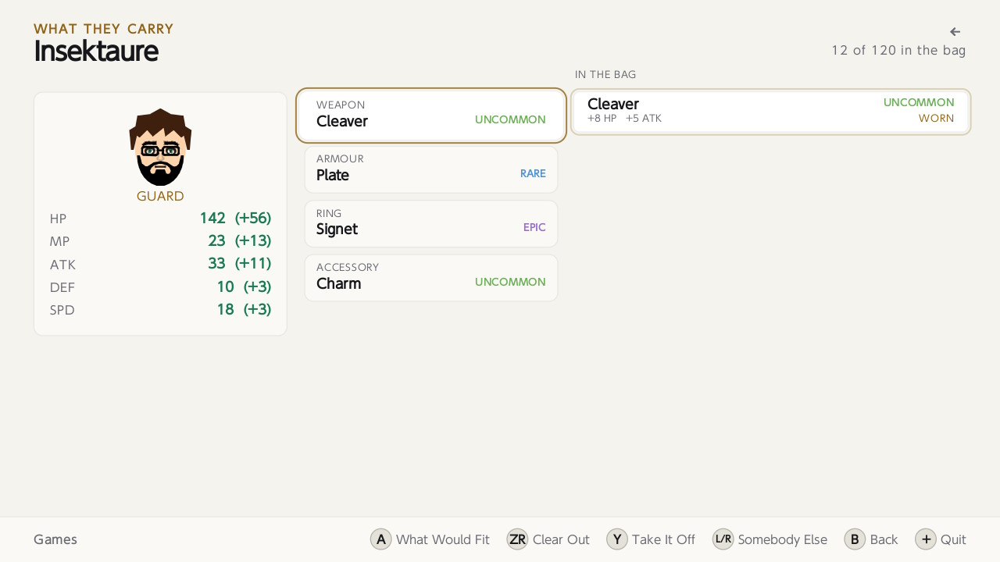 |  |
| *Their gear - four pegs, and what the bag has that would fit.* |  |

**Your pass, your Mii, your settings.**

| | |
| --- | --- |
|  |  |
| *Your pass - the left half is exactly what lands on somebody else.* | *The Mii maker - every part the wire format can carry.* |
|  |  |
| *Faces on the card - saved as files, yours to copy off.* | *Privacy - how much of a place you attach, and what rides along.* |
|  |  |
| *Exchange - how far a crossing reaches, and how many a day.* | *Notifications - a card in the corner, or nothing.* |
|  |  |
| *Appearance - light, dark or the console's, and whether things move.* |  |

## Credits

**[libnx](https://github.com/switchbrew/libnx)** - switchbrew and devkitPro.

**[deko3d](https://github.com/devkitPro/deko3d)** - fincs.

**[Mii Creator](https://github.com/AnonymousUser98/mii-creator)** - AnonymousUser98.


