# NX Plaza

An Online StreetPass System for the Nintendo Switch.

The 3DS traded a few hundred bytes with every console you physically walked
past. The Switch has no radio homebrew can drive that way, so **NX Plaza**
keeps everything else about the idea and moves the trade to the internet: your
console quietly swaps a small **pass** with other consoles that share your
network or your corner of the internet, and you come back later to a stack of
them.

## Screenshots

**The plaza.** What you come back to. The headline counts the crossings since
you last looked and names the places they happened in; the row underneath is
everything still unopened, newest first, each one badged **NEW** until you have
read it.

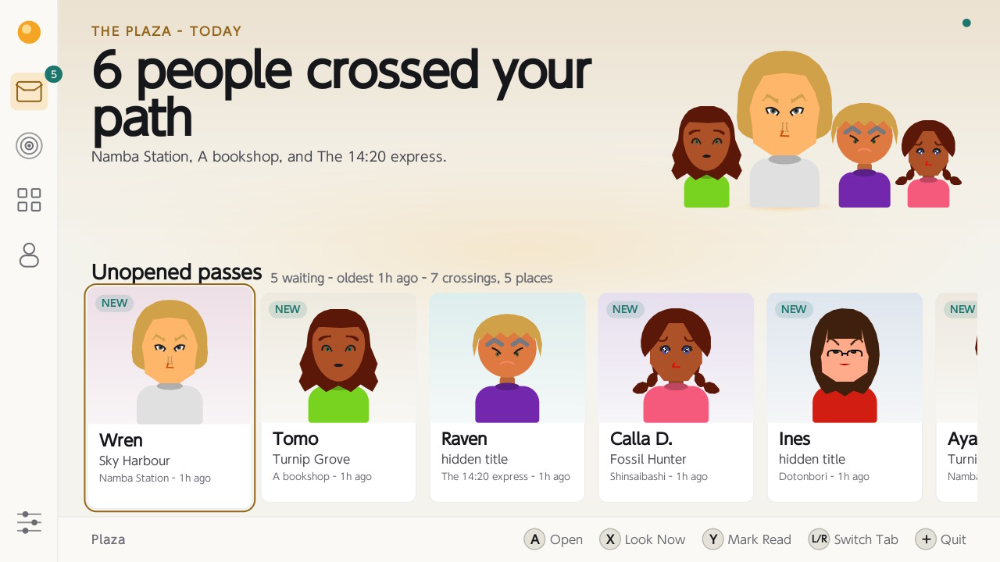

**A pass, opened.** The greeting they typed, what they are carrying, and the
numbers that build up as you keep running into each other. **L** and **R** walk
the rest of the stack without going back out to the list.

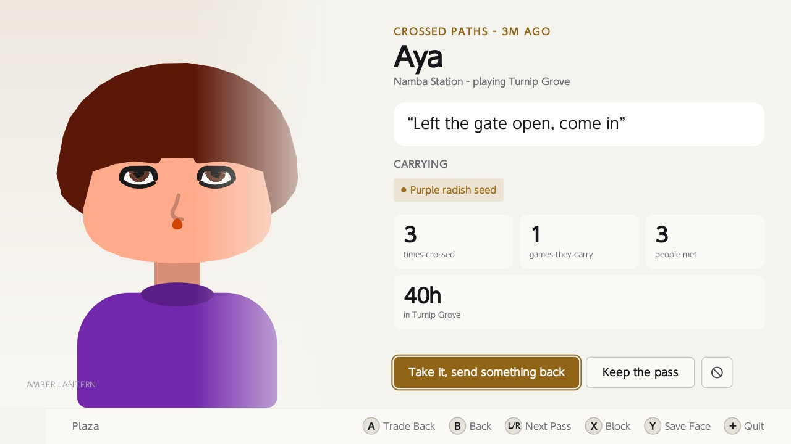

**The radar.** Who else has the app awake right now, in the reach you chose.
Trades happen on their own while this sits open.

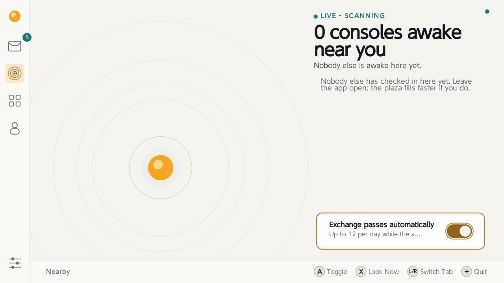

**The collection.** Everyone you have met, each card carrying when you last
crossed and, once it is more than one, how many times.

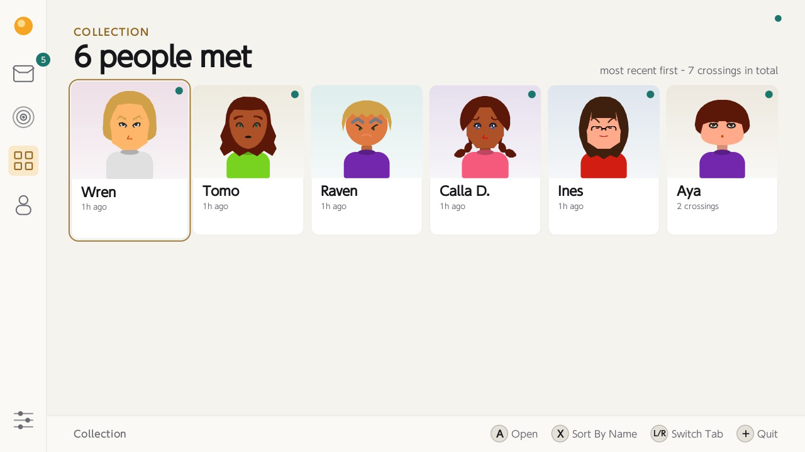

**The Square.** The same people, standing about in one place. Twenty of them at
a time, drawn from the collection and always including your own Mii, so the
square is never empty even on a console that has met nobody. They wander, they
occasionally say what their pass says, and **A** opens whoever the cursor is on.

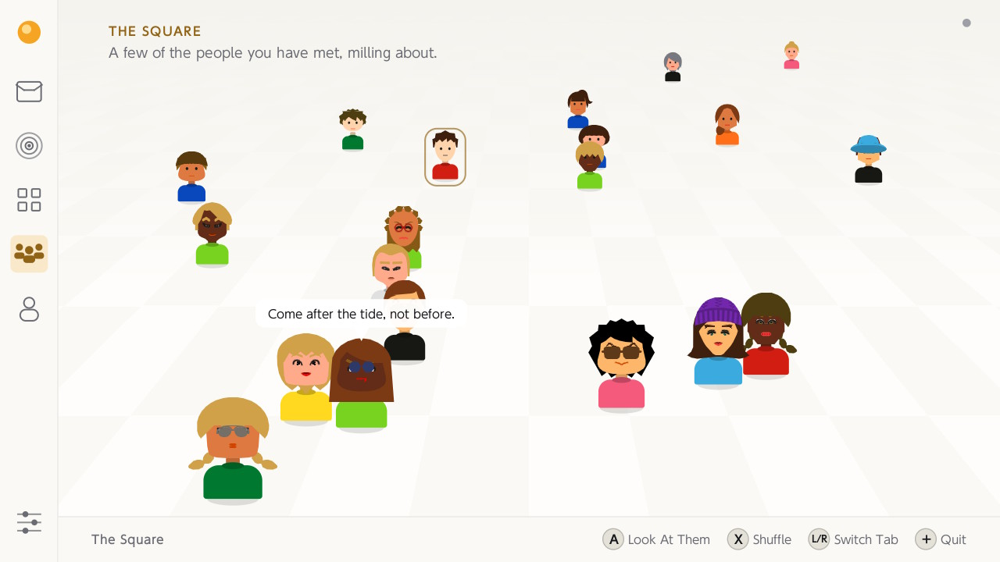

**Your pass.** The left half is exactly what lands on someone else's console:
nothing on this screen leaves without you having typed or picked it.

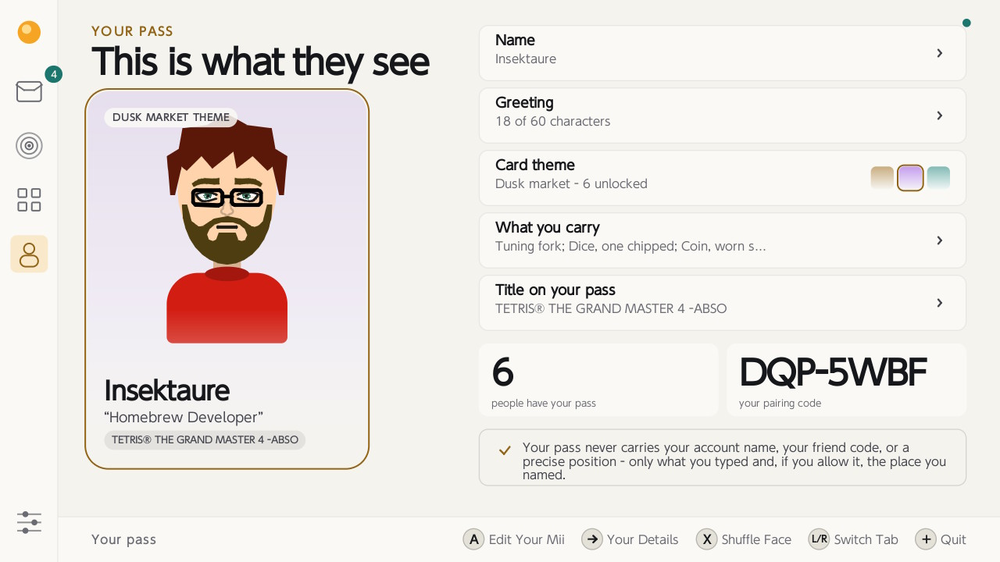

**The Mii maker.** Every part the wire format can carry, with the portrait
redrawing as you go. The strip underneath shows the sizes other screens will
render you at.

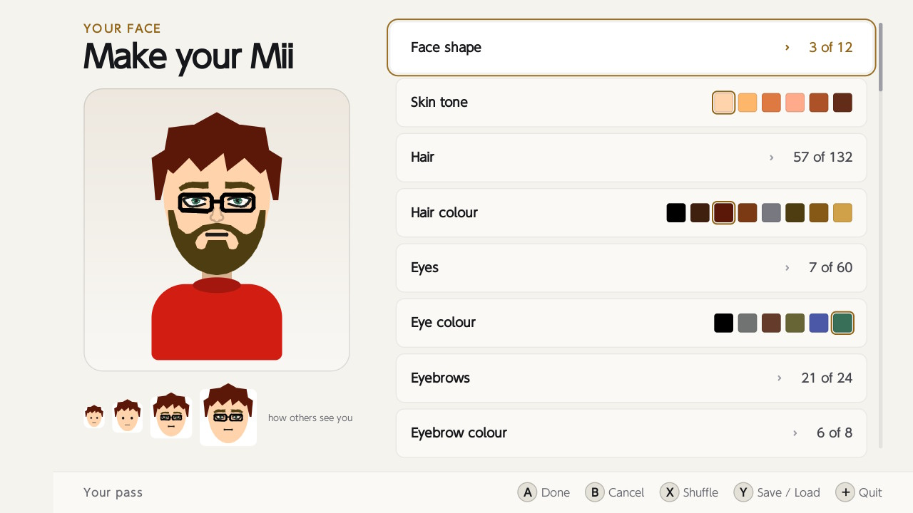

**Faces on the SD card.** Saving and loading Miis as files, so a face you liked
on someone else's pass can become one of yours.

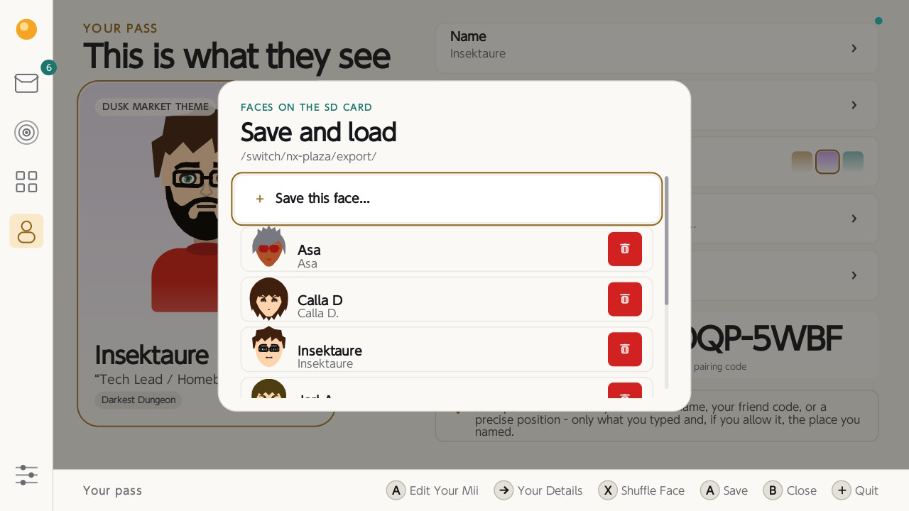

**Settings.** Six sections, each one page, no page longer than a screen. Four
of them:

| | |
| --- | --- |
| 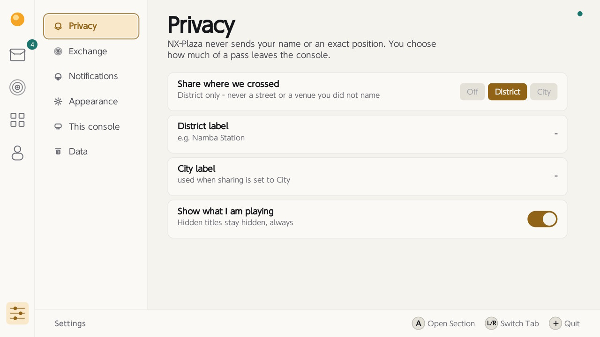 | 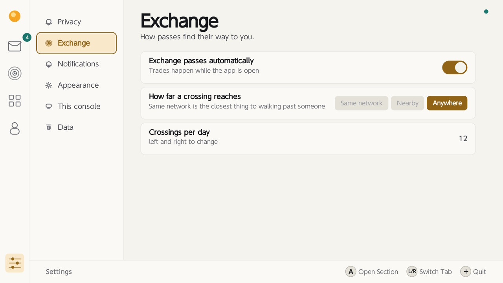 |
| *Privacy - how much of a place you attach, and whether a title rides along at all.* | *Exchange - how far a crossing reaches, and how many you will take in a day.* |
| 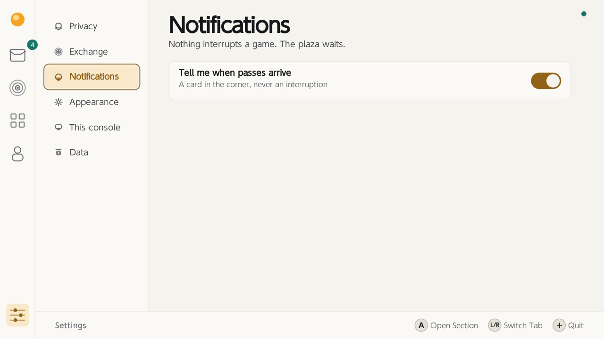 | 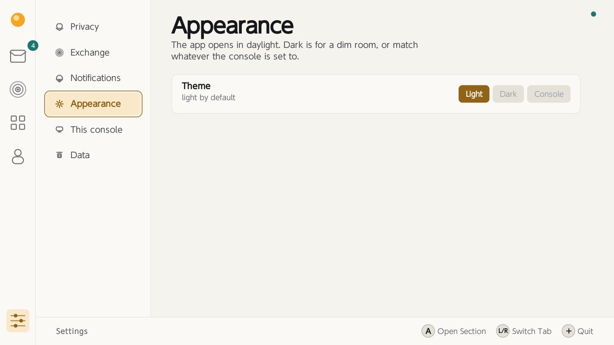 |
| *Notifications - a card in the corner, or nothing.* | *Appearance - light, dark, or whatever the console is set to.* |

## What a pass is

About 450 bytes of JSON. A chosen name, a greeting of at most 60 characters, a
card theme, **your Mii**, optionally a title you have played, up to four small
things you are "carrying", and a coarse place label you typed yourself.

The title is picked, not typed: the console keeps a play history, so *Your pass →
Title on your pass* steps through the last five games with **A** and defaults to
the most recent.

It is deliberately "last played" rather than "playing now" --
there is no such thing while this app is in the foreground, since homebrew
launched from hbmenu has either taken the game slot or is sitting over the album.

*Settings → Show what I am playing* strips it from the outgoing pass entirely,
and a console that has played nothing shows the row as empty rather than
inventing one.

It never contains your account name, your friend code, your IP, or a position.

## Your Mii

Make a face in *Your pass → Your Mii*: face shape, skin, hair and its colour,
eyes and theirs, eyebrows, nose, mouth, glasses, facial hair, headwear, build,
and the placement of it all. **X** shuffles, **A** keeps it, **B** backs out, and
**L/R** jump ten at a time through the long lists.

Every part carries the scale, rotation and position the Mii format gives it -
eye width, height and tilt, eyebrow spacing, thickness and tilt, and the size and
placement of the nose, mouth, moustache, glasses and mole. Two faces built from
the same parts are told apart by exactly those.

The parts are the real Mii catalogue - 12 face shapes, 132 hairstyles, 60 eyes,
36 mouths, 24 eyebrows, 18 noses, 20 glasses, 12 wrinkles, 12 makeup, 6
moustaches, 6 beards and 8 hats.

A moustache and a beard are separate, as they are in the Mii format, so
you can wear both.

A pass that has never been through the maker still shows a face: one derived
from the portrait seed the pass already carries. Nobody is a blank silhouette.

## Identity

On the very first launch the app generates:

| Field | Size | Purpose |
| --- | --- | --- |
| `id` | 128 bits, hex | public; travels with every pass so repeat crossings can be recognised |
| `token` | 256 bits, hex | secret; bearer token that proves the id is yours |

Both come from the console's CSPRNG (`csrngGetRandomBytes`, falling back to
`randomGet`) and are stored at `sdmc:/switch/nx-plaza/identity.json`.

Nothing about them is derived from the hardware: no serial, no MAC, no account id.

Copy that file to move your plaza identity to another console; delete it (or use
*Settings → Start over*) and you are somebody new, with everything you already
handed out permanently unlinkable from you.

The first-run screen shows a short human form of the id (e.g. `K4M-92X7`) plus
a 9×9 fingerprint pattern, so two people standing together can confirm they are
looking at the same console without reading 32 hex characters aloud.

## How "walking past someone" works without a radio

Two signals, both of which the console can produce honestly:

1. **Place token** - `SHA-256("nx-plaza/place/v1|" + SSID)`, truncated to 64
   bits, computed *on the console*. Two Switches on the same café, station or
   campus network land in the same bucket. The SSID itself never leaves the
   console.
2. **Network area** - the server buckets the source address by `/24` (IPv6
   `/48`). This catches consoles on Ethernet, and groups people behind the same
   ISP egress.

*Settings → How far a crossing reaches* picks how much of that you accept:
`Same network` (closest to real StreetPass), `Nearby`, or `Anywhere` - a
world plaza, so an empty town is not a dead app.

**`Anywhere` is the default.** The narrower settings are closer to what
StreetPass actually was.

Exchanges are mutual and rate limited: at most 12 crossings a day by default,
one crossing per pair per six hours.

## Building

Requires devkitPro with the Switch toolchain:

```sh
dkp-pacman -S switch-dev deko3d switch-curl switch-freetype switch-jansson switch-mbedtls
make            # -> nx-plaza.nro
make DEBUG=1    # links -ldeko3dd, the deko3d validation layer
```

Copy `nx-plaza.nro` to `sdmc:/switch/nx-plaza/nx-plaza.nro` and launch it from
hbmenu.

Fonts come from the console's own shared font block, so nothing is
bundled but the two compiled shaders.

## Controls

Every screen carries the same control strip along the bottom, so the buttons
are always spelled out for the view you are on.

| Input | Action |
| --- | --- |
| L / R | previous / next tab |
| D-pad or stick | move the cursor |
| A | open, edit, toggle - in the square, look at whoever the cursor is on; in Settings, the only way into a section |
| B | back |
| X | plaza: look for passes now · collection: change sort · the square: shuffle the crowd · your pass: new portrait · encounter: block and forget · Mii maker: shuffle |
| Y | plaza: mark everything read · encounter and radar: save that face · Mii maker: save / load faces |
| B | back - in Settings, out of a section's rows to the section list |
| + | quit |

Handheld adds touch. It is additive: every button above still does what it did.

| Touch | Action |
| --- | --- |
| drag | scroll the plaza, the collection or the settings list |
| flick | scroll with momentum; touch again to stop it |
| tap a card, row or setting | select it and open, edit, or toggle it |
| tap someone in the square | look at their pass |
| tap one option of a segmented control | choose exactly that option |
| tap an icon in the rail | switch tab |
| tap outside a sheet or dialog | close it |
| tap a notification | dismiss it |
| tap the bin on a saved face | delete it, after confirming |
| tap your own portrait on the pass screen | reroll it |

The cursor and the finger stay in step: moving the cursor scrolls the list to
keep it visible, and after a drag the cursor moves to whatever is nearest the
middle of what you are now looking at, so pressing **A** always acts on
something on screen.

The panel is inert when docked, and the code needs no special case for that: the
console simply reports no touches.

## Files on the SD card

```
sdmc:/switch/nx-plaza/
  identity.json    public id + secret token (back this up)
  profile.json     your pass and every setting
  crossings.idx    the passes you have collected, one 128-byte record each
  crossings.dat    their text: greetings, what they carry, where you crossed
  plaza.log        only when Settings turns it on; off by default
  plaza.log.1      the previous 256 KB, kept when the log rotates
  cacert.pem       needed for https connections to the plaza server
  export/          faces you saved, one JSON file each
```

`export/` is the only folder you are meant to open.

**Y** in the Mii maker opens
it: the top row saves the face you are editing under a name you type, and every
row below loads one back, or is deleted with the red bin on its right - press
**Right** to cross to it, or just tap it - after a confirmation. **Y** on a
card - an encounter, or a console on the radar - saves that person's face
there too, so a face you liked is yours to keep and to build on.

Files are named by what you type, so they are yours to copy off the card, hand around and drop
back in; anything already in the folder shows up in the list.

A face saved by a different version is listed but will not load, for the same reason one does not
come off the wire: the indices mean different things and it would come back as somebody else.

## Light and dark

The app opens in **light** and can be switched in *Settings → Appearance →
Theme*: `Light`, `Dark`, or `Console` (follow the Switch's own light/dark
setting, re-read whenever the app regains focus). The choice is saved in
`profile.json`.

## Disclaimer

This is a homebrew app. It is not affiliated with Nintendo, and it is not
officially supported. Use at your own risk. The author is not responsible for
any damage or loss of data that may occur from using this app.

## Credits

**[libnx](https://github.com/switchbrew/libnx)** - switchbrew and devkitPro.

**[deko3d](https://github.com/devkitPro/deko3d)** - fincs.

**[Mii Creator](https://github.com/AnonymousUser98/mii-creator)** - AnonymousUser98.


